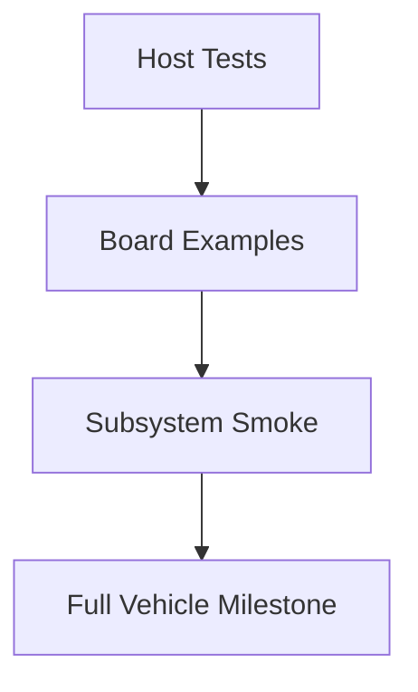

# AP_HAL_RTT 逐驱动验证设计

## 目标

`AP_HAL_RTT` 已经在 `CUAV v5` 上形成了可运行基线，但如果后续仍只依赖整机 bring-up 来判断问题，复杂度会迅速失控：

- 很难区分问题属于 `HAL`、`BSP`、`hwdef`、驱动还是主机环境
- 很多问题只有在 `Copter::setup()` 或 `MAVLink` 层才暴露，定位跨度过大
- 新板 bring-up 时容易在错误层级上深挖

因此需要建立一层“逐驱动验证”体系，把验证从“整机是否能跑”拆成“驱动、总线、子系统是否逐层成立”。

## 验证金字塔



### Host Tests

适合纯逻辑、无需真实硬件的对象：

- `hwdef` 解析与表生成
- 设备表映射
- 缓冲区、状态机、纯函数逻辑

这类测试应优先放入 `tests/`，用于回归和 CI。

### Board Examples

适合必须依赖目标板或真实外设的对象：

- `UART`
- `USB CDC`
- `SPI`
- `Storage`
- `PWM`
- `ADC`

这类验证应尽量是最小程序，只验证一条驱动链或一个子系统，不依赖整个 `Copter` 业务流程。

### Subsystem Smoke

用于验证几类驱动协同是否成立，例如：

- 传感器链：`SPI + IMU/Baro`
- 通信链：`UART/USB + MAVLink`
- 参数链：`Storage + AP_Param`

### Full Vehicle Milestone

整机里程碑验证不应替代驱动级验证，而应建立在前面几层已经尽量成立的基础上。

## 推荐目录结构

```text
libraries/AP_HAL/examples/            # 通用 HAL 能力 example
libraries/AP_HAL_RTT/examples/        # RTT 专属、与 BSP/hwdef 强相关的 example
libraries/AP_HAL/tests/               # 与硬件无关的主机侧测试
libraries/AP_HAL_RTT/tests/           # 仅当存在 RTT 专属纯逻辑对象时引入
```

## `AP_HAL/examples` 与 `AP_HAL_RTT/examples` 的分工

### `libraries/AP_HAL/examples/`

适合放置与具体 RTOS/BSP 无关、主要验证 `AP_HAL` 抽象语义的 example：

- `UART_test`
- `BinarySem`
- `Storage`
- `RCOutput`
- `AnalogIn`

如果某个例子主要是在验证“抽象接口是否符合预期”，就优先放在这里。

### `libraries/AP_HAL_RTT/examples/`

适合放置明显依赖 RTT 设备模型、BSP、`hwdef` 生成宏或板级 attach 逻辑的 example：

- SPI 设备表与 `HAL_SPI_DEVICE_LIST`
- RT-Thread 设备名与 attach 一致性
- `USB CDC` 的 `rt_device` 行为
- `DeviceBus` 与 `Scheduler` 的 RTT 调度行为

如果某个例子一看就依赖 `AP_HAL_RTT` 的实现细节，而不是通用 `AP_HAL` 语义，就应放在这里。

## 首批逐驱动验证对象

### 1. `scheduler-smoke`

- 目标子系统：`Scheduler` / `DeviceBus`
- 建议路径：`libraries/AP_HAL_RTT/examples/scheduler-smoke/`
- 成功判据：
  - 周期回调计数稳定递增
  - 任务延时与调度符合预期
- 典型失败：
  - 回调漂移过大
  - 线程优先级导致饥饿

### 2. `uart-smoke`

- 目标子系统：`UARTDriver`
- 建议路径：优先参考 `libraries/AP_HAL/examples/UART_test/`
- 成功判据：
  - 至少一条串口初始化成功
  - TX/RX 路径有明确可观测输出
- 典型失败：
  - 设备名不匹配
  - 延期开启逻辑未生效

### 3. `usb-cdc-smoke`

- 目标子系统：`USB CDC` / `rt_device` / 枚举与基本收发
- 建议路径：`libraries/AP_HAL_RTT/examples/usb-cdc-smoke/`
- 成功判据：
  - Windows 侧枚举为 `ArduPilot` 串口
  - 基础收发成立
- 典型失败：
  - 仅枚举成功但无数据
  - WSL2 `usbipd` 结果误导

### 4. `spi-ms5611-smoke`

- 目标子系统：`SPIDevice` / `SPIDeviceManager` / `BSP attach`
- 建议路径：`libraries/AP_HAL_RTT/examples/spi-ms5611-smoke/`
- 成功判据：
  - 能找到设备
  - 可读 `PROM`
  - CRC 正确
- 典型失败：
  - 设备表错
  - `CS` 错
  - 锁语义/传输语义错误

### 5. `imu-whoami-smoke`

- 目标子系统：IMU 探测链
- 建议路径：`libraries/AP_HAL_RTT/examples/imu-whoami-smoke/`
- 成功判据：
  - 至少一个目标 IMU 的 `WHO_AM_I` 合法
- 典型失败：
  - 全 `0xFF`
  - 模式/频率不对

### 6. `storage-smoke`

- 目标子系统：`Storage`
- 建议路径：优先参考 `libraries/StorageManager/examples/StorageTest/`
- 成功判据：
  - 写入后重读一致
  - 若为持久化后端，重启后结果仍正确
- 典型失败：
  - RAM stub 冒充持久化
  - FRAM 后端初始化不完整

### 7. `pwm-output-smoke`

- 目标子系统：`RCOutput`
- 建议路径：优先参考 `libraries/AP_HAL/examples/RCOutput/`
- 成功判据：
  - 输出通道初始化成功
  - 可观测到 PWM 变化
- 典型失败：
  - BSP 未启用 PWM
  - `_write_hw` 未形成真实后端

### 8. `analogin-smoke`

- 目标子系统：`AnalogIn`
- 建议路径：优先参考 `libraries/AP_HAL/examples/AnalogIn/`
- 成功判据：
  - ADC 值可读
  - 采样周期与调度路径成立
- 典型失败：
  - BSP 未启用 ADC
  - `_timer_tick` 未被调度

## 与当前 `CUAV v5` 基线的关系

当前 `CUAV v5` 基线已经证明：

- `boot -> scheduler -> main -> hal.run()`
- `USB CDC / MAVLink`
- 至少一条 `SPI -> IMU / Baro` 路径

逐驱动验证层不是要重新证明整机能跑，而是把这些结论拆成可重复、可迁移、可作为新板模板的独立门禁。

## 与治理系统中其他文件的关系

### 放在这里的内容

- 分类验证方法
- 成功判据
- 失败分支
- `examples/tests` 的推荐落点

### 不放在这里的内容

- 当前稳定事实：放 `.cursor/project/status.md`
- 当前未关闭问题：放 `.cursor/project/open-issues.md`
- 阶段计划：放 `.cursor/project/milestone-plan.md`
- 长流水账：放 `.cursor/agent-trace.md`
- 固定命令速查：放 `.cursor/project/command-catalog.md`

## 作为里程碑判据的使用方式

今后里程碑不应只写“整机可运行”，而应尽量写成：

- 哪些 driver examples 已通过
- 哪些 subsystem smoke 已通过
- 哪些能力仍只有整机层验证、缺少驱动级门禁

这样后续做 `GD32`、`AT32` 或其他板时，就能直接按这一层去复用，而不是重新从整机现象倒推根因。
