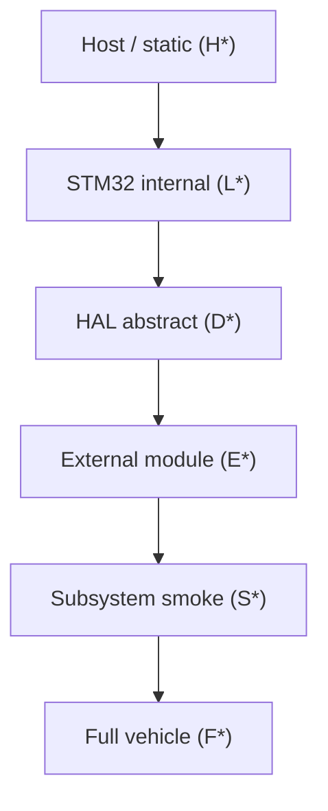

# AP_HAL_RTT 逐驱动验证设计

## 目标

`AP_HAL_RTT` 已经在 `CUAV v5` 上形成了可运行基线，但如果后续仍只依赖整机 bring-up 来判断问题，复杂度会迅速失控：

- 很难区分问题属于 `HAL`、`BSP`、`hwdef`、驱动还是主机环境
- 很多问题只有在 `Copter::setup()` 或 `MAVLink` 层才暴露，定位跨度过大
- 新板 bring-up 时容易在错误层级上深挖

因此需要建立一层“逐驱动验证”体系，把验证从“整机是否能跑”拆成“驱动、总线、子系统是否逐层成立”。

**事实边界**：本文档是设计与门禁定义；**当前哪些已构建、哪些已上板通过**以 `.cursor/project/driver-validation-matrix.md` 为准。未在矩阵中标记为「已通过（上板）」的项，不得对外宣称已验证通过。

---

## 六层验证模型（推荐执行顺序）

与 ChibiOS / `AP_HAL` examples 审计结论对齐：先 **Host/static** 与 **STM32 寄存器 bring-up**，再 **HAL 抽象**，再 **外置器件**，最后 **子系统 smoke** 与 **整机**。



| 层 | CLI 前缀 | 目录（canonical） | 验证什么 | 典型工具 |
|----|----------|-------------------|----------|----------|
| **Host / static** | `H*`（规划） | `libraries/AP_HAL_RTT/tests/` 或 Python 脚本 | `hwdef` 解析、SPI 设备表、probe 列表、纯逻辑 | 主机 `scons`/pytest，无板 |
| **STM32 internal** | `L0`…`L7` | `libraries/AP_HAL_RTT/test/bringup/`、`test/usb/` | 时钟、GPIO、UART/SPI 寄存器、USB IP、板载 WHO_AM_I（裸寄存器） | `scons --test=L*` |
| **HAL abstract** | `D*`（规划） | `libraries/AP_HAL_RTT/test/drivers/D*/` | `UARTDriver`、`SPIDevice`、`I2C`、`Storage`、`RCOutput`、`RCInput`、`AnalogIn` 等 **AP_HAL 语义** | `scons --test=D_*` |
| **External module** | `E*`（规划） | `libraries/AP_HAL_RTT/test/drivers/E*/` | 具体芯片：IMU、气压计、罗盘、FRAM、SD 卡、WSPI Flash、SBUS 前端等 | `scons --test=E_*` |
| **Subsystem smoke** | `S*`（规划） | `libraries/AP_HAL_RTT/test/subsystem/` | 多驱动链：传感器链、参数链、MAVLink 链等 | `scons --test=S_*` |
| **Full vehicle** | （无独立 `--test=`） | `ArduCopter` 全固件 | L0 里程碑：boot → scheduler → MAVLink STANDBY | 烧录 + OpenOCD + pymavlink |

**与旧版四段金字塔的关系**：原 “Host → Board Examples → Subsystem → Full Vehicle” 仍成立；本模型把 “Board Examples” 拆成 **STM32 internal（L*）**、**HAL（D*）**、**外置器件（E*）** 三层，避免把寄存器冒烟与 `UARTDriver::begin()` 混为一谈。

---

## 内置外设（STM32 / SoC）— 最小行为与分层落点

下列为 **MCU 侧**能力；在 CUAV V5 上是否布线以 `hwdef.dat` 为准。

| 内置外设 | STM32 internal（L*）最小行为 | HAL abstract（D*）最小行为 | 参考 example / 测试 | 外接硬件 |
|----------|------------------------------|----------------------------|----------------------|----------|
| **UART** | 时钟使能、BRR/ISR、多路 USART 寄存器可读 | `serial(N)->begin()`、TX 字节、可选 RX 回环 | `AP_HAL/examples/UART_test`、`UART_chargen`；RTT：`L3_uart` | 回环线或 USB‑串口助手；GPS/数传为可选 |
| **SPI** | SPI1 轮询收发、CS GPIO、WHO_AM_I 读寄存器 | `SPIDevice` 传输、`get_semaphore`、设备表 devid | `AP_HAL/examples` 无独立 SPI；库级 `BusTest`（ChibiOS 树）；RTT：`L4_spi` | 板载 IMU/Baro/FRAM（见 E*） |
| **I2C** |（待增 `L5_i2c`）总线复位、地址扫描或 ACK 探测 | `I2CDevice` / `I2CBus` 读 WHO_AM_I 或寄存器 | ChibiOS 语义 `BusTest`；库级 `AP_Compass_test` | 板载 IST8310（CUAV V5 I2C3） |
| **SDMMC** |（待增 `L6_sdmmc`）CLK/CMD/D0–D3 初始化、卡识别 | `AP_Filesystem` / SD 挂载、单扇区读写 | `libraries/AP_Filesystem/examples/File_IO` | **必须**插入 microSD |
| **ADC** |（待增）ADC 时钟、校准、单通道采样 | `AnalogIn` channel 读数、`_timer_tick` 调度 | `AP_HAL/examples/AnalogIn` | 板载分压/无额外件；精度用万用表可选 |
| **PWM / Timer** |（待增）TIM 时钟、OC 使能 | `RCOutput` 多路 `write`、频率/脉宽 | `AP_HAL/examples/RCOutput`、`RCOutput2` | 示波器或舵机/ESC（**禁止**带桨上电） |
| **USB** | DWC2 寄存器 / CherryUSB 栈 | `rt_device` CDC、`UARTDriver` OTG 路径 | RTT：`L7_cherryusb_cdc`；legacy `L5_usb`/`L6_cdc` | USB 线；Windows 枚举优先于 WSL2 |
| **WSPI / QUADSPI** |（板卡相关）QSPI 寄存器、读 JEDEC ID | `AP_FlashIface` / WSPI 擦写页 | `AP_FlashIface/examples/jedec_test*` | **CUAV V5 hwdef 无 WSPI**；Pixhawk6C/H7 等另板 |

---

## 外置模块 — 最小行为、example 与硬件

| 模块 | 总线 | External（E*）最小行为 | HAL（D*）前置 | 参考 example | 外接硬件 |
|------|------|------------------------|---------------|--------------|----------|
| **IMU**（ICM20689 等） | SPI1 | WHO_AM_I / 器件 ID 与 datasheet 一致 | `D_spi` + `SPIDevice` | `INS_generic`；RTT `L4_spi` 已覆盖寄存器级 | 板载，无飞线 |
| **Baro**（MS5611） | SPI1 | PROM 读、CRC 校验 | `D_spi` | `BARO_generic`；规划 `E_ms5611` | 板载 |
| **Compass**（IST8310） | I2C3 | 读 chip ID / 状态寄存器 | `D_i2c` | `AP_Compass/examples/AP_Compass_test`；规划 `E_ist8310` | 板载 |
| **FRAM**（FM25V02） | SPI2 | 读设备 ID、擦写一页 | `D_spi` + `D_storage` | `AP_HAL/examples/Storage`；`StorageManager/StorageTest`；规划 `E_fram` | 板载 |
| **SD Card** | SDMMC1 | 挂载、创建文件、读写校验 | `D_storage` / filesystem | `File_IO`；规划 `E_sdcard` | **必须**插卡 |
| **SBUS / RC 接收机** | UART 或 反相 GPIO | 帧同步、通道数、中立位 | `D_rcinput` | `AP_HAL/examples/RCInput`；`RCProtocol/examples/RCProtocolTest`；规划 `E_sbus` | **必须**接接收机或 SBUS 模拟器 |
| **ESC / 舵机** | PWM | 脉宽变化可观测 | `D_rcoutput` | `RCOutput`；`RCInputToRCOutput` | 示波器或无桨 ESC/舵机 |
| **WSPI Flash** | QUADSPI | JEDEC ID、页编程 | `D_wspi`（板卡限定） | `jedec_test` | 非 CUAV V5；需对应 hwdef |

---

## 当前 RTT 分层测试已有什么（2026-05-28 设计基线）

| 状态含义 | 说明 |
|----------|------|
| **已构建** | `scons --test=…` 链接成功；**不等于**上板通过 |
| **已上板通过** | 矩阵中显式记录；本子任务**未跑**烧录/OpenOCD/MAVLink |
| **待构建** | 目录或 manifest 已有，未确认构建 |
| **待实现** | 仅文档/manifest 规划名 |
| **N/A（板卡）** | 当前 hwdef 无该外设 |

| `--test=` | 层 | 当前状态（设计基线） | 备注 |
|-----------|-----|----------------------|------|
| `L0_system` | STM32 internal | **已构建** | SysTick / FPU / fault |
| `L1_iwdg` | STM32 internal | 待构建 | |
| `L2_gpio` | STM32 internal | 待构建 | |
| `L3_uart` | STM32 internal | 待构建 | 寄存器级，非 `UARTDriver` |
| `L4_spi` | STM32 internal | **已构建** | 含 ICM20689 WHO_AM_I（寄存器 SPI） |
| `L7_cherryusb_cdc` | STM32 internal + USB | **已构建** | CherryUSB echo；生产 USB 门禁 |
| `L5_usb` / `L6_cdc` | legacy | 调试 only | `_legacy_native/` |
| `D_uart` … `D_rcinput` | HAL abstract | **待实现** | 见 matrix |
| `E_*` | External module | **待实现** | 见 matrix |
| `S_*` | Subsystem | **待实现** | 见 matrix |
| 全固件 ArduCopter | Full vehicle | 整机层有部分现象 | 不能替代 driver 门禁 |

---

## 推荐目录结构

```text
libraries/AP_HAL/examples/            # 通用 HAL 能力 example（语义参考）
libraries/AP_HAL_RTT/examples/        # RTT 专属 example（逐步补齐）
libraries/AP_HAL_RTT/test/
  _common/
  bringup/          # L* — STM32 internal
  usb/              # L5–L7 USB
  drivers/
    D*/             # HAL abstract（规划）
    E*/             # External module（规划）
  subsystem/        # S*（规划）
libraries/AP_HAL/tests/               # 主机侧（H*，逐步补齐）
Tools/scripts/rtt_test_manifest.py    # --test= 名称解析
```

**Manifest 策略**：未创建 `SConscript` 的 `--test=` **不要**写入 `TEST_LAYOUT`，否则 `resolve_test_paths` 会 fallback 到不存在的 `hwdef/common/tests/test_<name>` 并破坏构建。规划名见 `libraries/AP_HAL_RTT/test/README.md`；实现时 **先落目录 + SConscript，再登记 manifest**。

---

## `AP_HAL/examples` 与 `AP_HAL_RTT/examples` 的分工

### `libraries/AP_HAL/examples/`

适合放置与具体 RTOS/BSP 无关、主要验证 `AP_HAL` 抽象语义的 example：

- `UART_test`、`UART_chargen`
- `Storage`
- `RCOutput`、`RCOutput2`、`RCInput`、`RCInputToRCOutput`
- `AnalogIn`
- `BinarySem`、`Printf`、`RingBuffer`

实现 RTT 版 `D_*` 测试时，**优先对照这些程序的调用顺序与成功判据**，在 `test/drivers/D*/` 用 `test_runner` 最小化。

### `libraries/AP_HAL_RTT/examples/`

适合放置明显依赖 RTT 设备模型、BSP、`hwdef` 生成宏或板级 attach 逻辑的 example：

- SPI 设备表与 `HAL_SPI_DEVICE_LIST`
- RT-Thread 设备名与 attach 一致性
- `USB CDC` 的 `rt_device` 行为
- `DeviceBus` 与 `Scheduler` 的 RTT 调度行为

---

## 首批逐驱动验证对象（smoke 命名）

与 `.cursor/project/driver-validation-matrix.md` 同步；下表为设计意图摘要。

| 名称 | 层 | 目标子系统 | 成功判据（摘要） |
|------|-----|------------|------------------|
| `scheduler-smoke` / `D_scheduler` | HAL | `Scheduler` / `DeviceBus` | 周期回调稳定；无饥饿 |
| `uart-smoke` / `D_uart` | HAL | `UARTDriver` | `begin` + TX（+ RX 回环） |
| `usb-cdc-smoke` | HAL + USB | CDC / `rt_device` | 枚举 + 收发（`L7` 为栈级门禁） |
| `spi-ms5611-smoke` / `E_ms5611` | Ext | SPI + MS5611 | PROM + CRC |
| `imu-whoami-smoke` / `E_imu` | Ext | IMU | 合法 WHO_AM_I |
| `storage-smoke` / `D_storage` | HAL | `Storage` | 写读一致；FRAM 重启保持 |
| `pwm-output-smoke` / `D_rcoutput` | HAL | `RCOutput` | PWM 可观测 |
| `analogin-smoke` / `D_analogin` | HAL | `AnalogIn` | ADC 可读、tick 调度 |
| `S_sensors` | Subsystem | SPI + IMU + Baro | 多器件 healthy |
| `S_param_storage` | Subsystem | Storage + `AP_Param` | 参数读写 |
| `S_mavlink_usb` | Subsystem | USB + MAVLink | 心跳（整机 L0 子集） |

---

## 与当前 `CUAV v5` 基线的关系

当前 `CUAV v5` 基线（整机层）已观察到：

- `boot -> scheduler -> main -> hal.run()`
- `USB CDC / MAVLink`（现象级，非本文档门禁表中的「已通过」）
- 至少一条 `SPI -> IMU / Baro` 路径（整机 init 内）

逐驱动验证层的目标是：把上述结论拆成 **可重复、可迁移、可作为新板模板** 的独立 `--test=` 门禁，并明确 **哪些仅构建、哪些必须外接硬件**。

---

## 与治理系统中其他文件的关系

### 放在这里的内容

- 分层模型、命名前缀、成功判据、失败分支
- `examples/tests` 的推荐落点与参考 example

### 不放在这里的内容

- 当前稳定事实：`.cursor/project/status.md`
- 当前未关闭问题：`.cursor/project/open-issues.md`
- 执行清单（构建/上板状态列）：`.cursor/project/driver-validation-matrix.md`
- 长流水账：`.cursor/agent-trace.md`
- 固定命令速查：`.cursor/project/command-catalog.md`

---

## 作为里程碑判据的使用方式

今后里程碑不应只写“整机可运行”，而应尽量写成：

- 哪些 **L\*** / **D\*** / **E\*** / **S\*** 已通过（区分 **已构建** 与 **已上板通过**）
- 哪些能力仍只有整机层验证、缺少驱动级门禁
- 哪些项对 CUAV V5 为 N/A（如 WSPI）

这样后续做 `GD32`、`AT32`、Pixhawk6C 或其他板时，就能按层复用，而不是从整机现象倒推根因。
